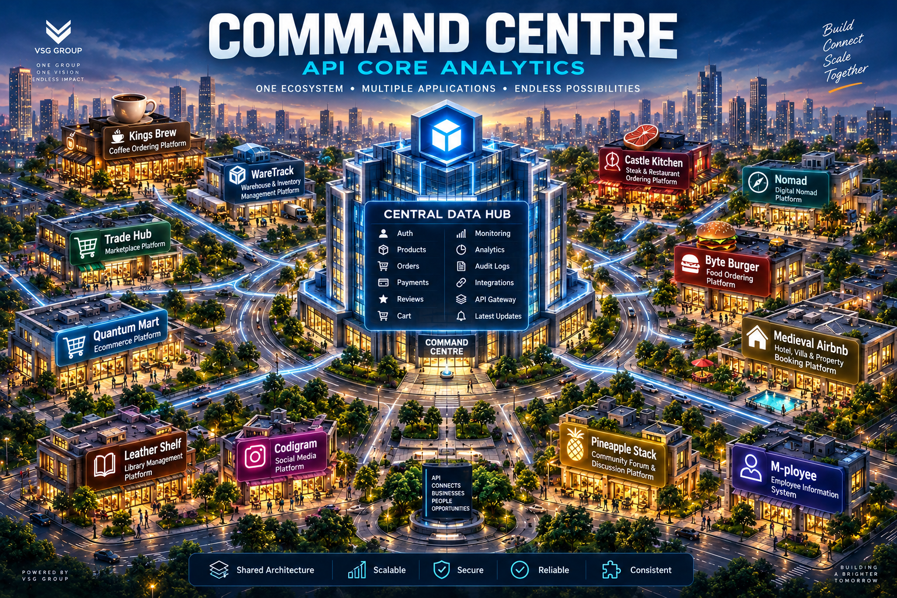

# Command Centre

Centralized monitoring dashboard for the Entrepreneur Topics Ecosystem.



## Overview

Command Centre is an enterprise-style administration dashboard used to monitor
and manage all applications within the Entrepreneur Topics Ecosystem from a
single interface.

Pages:

| Page           | Reads from   | Shows                                                                          |
| -------------- | ------------ | ------------------------------------------------------------------------------ |
| Command Centre | BFF          | Ecosystem-wide totals, latest activity, per-application overview               |
| Monitoring     | BFF          | Health, uptime and infrastructure status                                       |
| Applications   | Each backend | Resources per application (products, posts, books, employees, warehouses, ...) |
| Reviews        | Each backend | Reviews across every application that exposes them                             |
| Orders         | Each backend | Public orders                                                                  |
| Ecosystem Map  | —            | How the applications relate to each other                                      |

## Requirements

- Node.js 20+
- **Command Centre BFF** running, for the Command Centre and Monitoring pages.
  It serves cached snapshots of all backends, so those pages open instantly
  even while the backends are asleep on Render.

## Applications

| Application        | Group           | Description                               | Backend     |
| ------------------ | --------------- | ----------------------------------------- | ----------- |
| ☕ Kings Brew      | commerce-core   | Coffee Ordering Platform                  | Deployed    |
| 🥩 Castle Kitchen  | commerce-core   | Steak & Restaurant Ordering Platform      | Deployed    |
| 🍔 Byte Burger     | commerce-core   | Food Ordering Platform                    | Deployed    |
| 🛒 Quantum Mart    | commerce-core   | E-Commerce Platform                       | Deployed    |
| 🏪 Trade Hub       | commerce-core   | Marketplace Platform                      | Deployed    |
| 🍍 Pineapple Stack | operations-core | Community Forum & Discussion Platform     | Deployed    |
| 👨‍💼 M-ployee        | operations-core | Employee Information System               | Deployed    |
| 📸 Codigram        | operations-core | Social Media Platform                     | Deployed    |
| 📚 Leather Shelf   | operations-core | Library Management Platform               | Deployed    |
| 📦 WareTrack       | operations-core | Warehouse & Inventory Management Platform | Deployed    |
| 🏡 Medieval Airbnb | template        | Property Booking Platform                 | Coming soon |
| 🧭 Nomad           | template        | Digital Nomad Platform                    | Coming soon |

Each application's tabs, endpoints and supported query params are declared in
`src/features/applications/config/application.config.ts`, based on that
backend's Swagger. Adding an application is a config change, not a new page.

## Features

**Dashboard and Monitoring**

- One request to the BFF per page instead of dozens to the backends
- Snapshot age shown as "updated N minutes ago", with per-application errors
- Applications still being refreshed are marked and polled until they answer
- Uptime percentage over the last 24 hours

**Application resources**

- One data-driven page per application; tabs double as KPI cards
- Search, category filter, sorting and pagination, only where the backend
  supports them
- Resources needing an admin token are shown locked instead of failing
- Contextual detail panel for nested data, e.g. comments per post

**Reviews and Orders**

- Aggregated across every application that exposes a public endpoint
- Each application is fetched separately, so a slow backend only delays itself
- Applications without the endpoint are listed as "Coming soon"

## Technology Stack

| Area    | Tools                                                          |
| ------- | -------------------------------------------------------------- |
| Core    | React 19, TypeScript, Vite                                     |
| Styling | Tailwind CSS, shadcn/ui, Radix UI, Framer Motion, Lucide React |
| Data    | TanStack Query, Axios                                          |
| Tables  | TanStack Table                                                 |
| Routing | React Router                                                   |
| Testing | Jest, ts-jest, Supertest                                       |

## Project Structure

```bash
src/
│
├── app/                  # App, providers, router, route paths
├── components/
│   ├── data-table/
│   ├── shared/           # Filters, page header, state, detail panel
│   └── ui/               # shadcn components
│
├── features/
│   ├── applications/     # Per-application resource pages
│   │   ├── api/
│   │   ├── columns/
│   │   ├── components/
│   │   ├── config/       # The 12 applications and their endpoints
│   │   ├── hooks/
│   │   ├── pages/
│   │   ├── tabs/
│   │   ├── types/
│   │   └── utils/
│   ├── bff/              # Client for the Command Centre BFF
│   │   ├── api/
│   │   ├── hooks/
│   │   ├── types/
│   │   └── utils/        # Maps BFF responses to the dashboard's shape
│   ├── dashboard/        # Command Centre overview
│   ├── ecosystem-map/
│   ├── monitoring/
│   ├── orders/
│   └── reviews/
│
├── layouts/
├── lib/                  # Axios, query client, retry policy, constants
└── main.tsx
```

## Getting Started

```bash
npm install
cp .env.example .env
npm run dev
```

The dev server runs on port 5000.

Start the BFF in a second terminal, otherwise the Command Centre and
Monitoring pages show a connection error:

```bash
cd ../command-centre_bff && npm run start:dev
```

### Scripts

| Script               | Description                         |
| -------------------- | ----------------------------------- |
| `npm run dev`        | Development server on port 5000     |
| `npm run build`      | Type-check and build for production |
| `npm run preview`    | Serve the production build          |
| `npm run lint`       | ESLint                              |
| `npm test`           | Unit tests                          |
| `npm run test:watch` | Unit tests in watch mode            |

API contract tests hit the deployed Kings Brew API and are skipped by default:

```bash
RUN_INTEGRATION_TESTS=true npm test
```

## Environment Variables

Copy `.env.example` to `.env`.

| Variable                 | Description                                                      |
| ------------------------ | ---------------------------------------------------------------- |
| `VITE_APP_NAME`          | Display name of the dashboard                                    |
| `VITE_BFF_URL`           | Base URL of the Command Centre BFF, e.g. `http://localhost:3000` |
| `VITE_<APPLICATION>_URL` | Base URL of each backend. Empty means "not deployed"             |

See `.env.example` for the full list of application URLs.

## Design Principles

Inspired by Stripe Dashboard, Shopify Admin, GitHub Enterprise, Vercel
Dashboard and Linear:

- Simplicity
- Consistency
- Scalability
- Performance
- Data-first design

## License

MIT License

---

Built with ❤️ by Vincent Guizot
